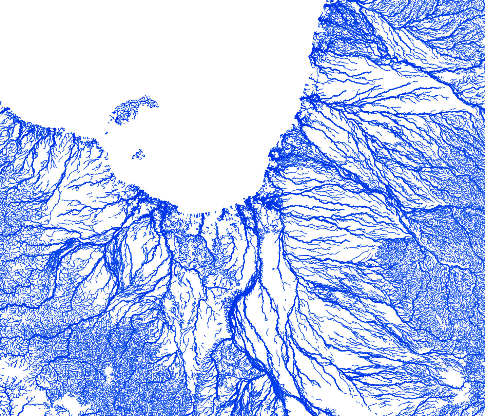

# australian-rivers
Every mapped stream and river in Australia! Map created with [QGIS](http://www.qgis.org/en/site/) using data for 1.3 million streams from [Geoscience Australia GEODATA TOPO 250K](#data) vector datasets. Many arid-zone rivers and streams in these maps are highly ephemeral, and may only flow once every few years or even decades. Streams are weighted by both ephemerality (perennial or non-perennial) and hierarchy (minor or major), with the highest weighting for major perennial rivers (i.e. Murray River). 

###Digital prints##
Beautiful high resolution digital prints of these maps (in lossless PNG file format suitable for printing on large canvases and posters) are [now available for purchase from my Etsy store!](https://www.etsy.com/au/shop/EarthArtAustralia)

**Email:** r.bishop-taylor@unsw.edu.au
**Twitter:** [@robbibt](https://twitter.com/robbibt)

### Entire Australia ###

### North-west Queensland ###

### North-east Murray-Darling Basin ###

### Top End, Northern Territory ###

### North-west Queensland ###

### Central Queensland ###

### Goldfields-Esperance, Western Australia ###

#### <a name="data">Source dataset</a> ####
Geoscience Australia (2006). Geodata topo 250k series 3. _Geoscience Australia, Canberra._ Available at http://www.ga.gov.au/metadata-gateway/metadata/record/gcat_63999 under a **Creative Commons Attribution 4.0 International Licence**. Full terms at https://creativecommons.org/licenses/by/4.0/.

